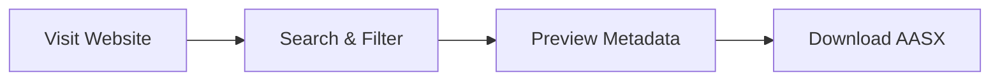
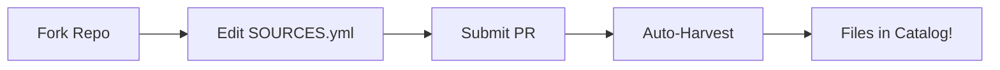
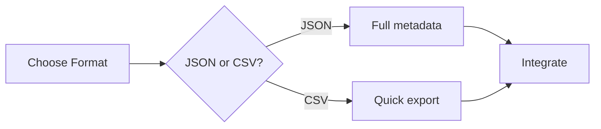
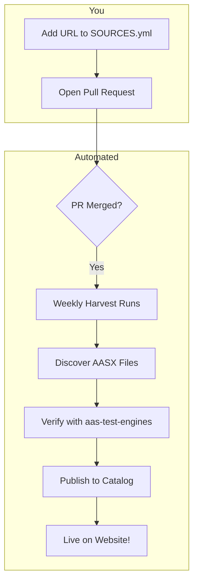
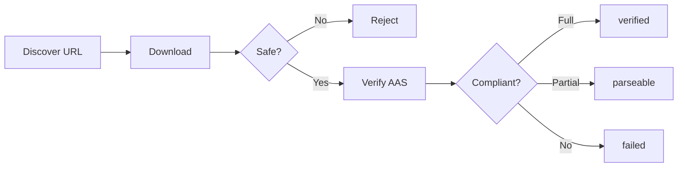

# Open AASX Index

**The community catalog of verified Asset Administration Shell files.**

Discover, download, and contribute AASX files from across the web — all verified against the official AAS specification.

[]()
[]()
[]()

[**Browse the Catalog →**](https://hadijannat.github.io/open-aasx-index/)

---

## What is this?

Open AASX Index automatically discovers AASX files from GitHub repositories, official sources, and community contributions. Every file is:

- **Downloaded** safely (size limits, zip-bomb detection)
- **Verified** against the AAS specification using [aas-test-engines](https://github.com/admin-shell-io/aas-test-engines)
- **Cataloged** with metadata extracted via [BaSyx SDK](https://github.com/eclipse-basyx/basyx-python-sdk)
- **Published** weekly as JSON, CSV, and a searchable website

---

## Choose Your Path

### I want to find AASX files

Browse the catalog to discover verified AAS files for your research or project.



**[Open the Catalog →](https://hadijannat.github.io/open-aasx-index/)**

---

### I want to contribute AASX sources

Know a website or repository with AASX files? Add it to our sources and we'll automatically discover and verify them.



**[How to Contribute →](#contributing-sources)**

---

### I want to use the data

Download the catalog for your own tools, research, or integration.



**[Download & API →](#download-the-data)**

---

## Contributing Sources

Adding a new source takes just 3 steps:

### Step 1: Fork & Edit

Edit `SOURCES.yml` and add your source:

```yaml
sources:
  # Your new source
  - url: https://example.com/aasx-samples/
    name: Example Corp Digital Twin Samples
    type: seed
    notes: Official AASX files from Example Corp
```

**Source types:**

| Type | Use for |
|------|---------|
| `seed` | Web pages with direct `.aasx` download links |
| `repo` | GitHub repositories containing AASX files |

### Step 2: Submit a Pull Request

1. Commit your changes
2. Open a PR against `main`
3. Our CI will validate your YAML syntax

### Step 3: Watch the Magic

Once merged, the weekly harvest will:
1. Crawl your source for `.aasx` links
2. Download and verify each file
3. Add verified files to the catalog
4. Update the website automatically



> **Can't wait for Sunday?** Maintainers can trigger the harvest manually via GitHub Actions.

---

## Download the Data

The catalog is freely available in multiple formats:

| Format | Best For | Link |
|--------|----------|------|
| **JSON** | Full metadata, programmatic access | [catalog.json](https://hadijannat.github.io/open-aasx-index/catalog.json) |
| **CSV** | Spreadsheets, quick analysis | [catalog.csv](https://hadijannat.github.io/open-aasx-index/catalog.csv) |
| **Stats** | Dashboard widgets, monitoring | [stats.json](https://hadijannat.github.io/open-aasx-index/stats.json) |

### Quick Examples

**Download with curl:**
```bash
curl -O https://hadijannat.github.io/open-aasx-index/catalog.json
```

**Filter verified files with jq:**
```bash
jq '[.[] | select(.verification.status == "verified")]' catalog.json
```

**Load in Python:**
```python
import requests

catalog = requests.get(
    "https://hadijannat.github.io/open-aasx-index/catalog.json"
).json()

verified = [f for f in catalog if f["verification"]["status"] == "verified"]
print(f"Found {len(verified)} verified AASX files")
```

### Data Schema

Each catalog entry includes:

| Field | Description |
|-------|-------------|
| `id` | Unique identifier (SHA256 of URL) |
| `url` | Direct download link |
| `file.size_bytes` | File size |
| `file.sha256` | Content hash for integrity |
| `verification.status` | `verified`, `parseable`, or `failed` |
| `verification.errors` | List of compliance issues (if any) |
| `metadata` | Extracted AAS metadata (shells, submodels) |

Full schema: [catalog.schema.json](data/schema/catalog.schema.json)

---

## How Verification Works

Every discovered file goes through a verification pipeline:



### Verification Statuses

| Status | Meaning |
|--------|---------|
| `verified` | Passes all [aas-test-engines](https://github.com/admin-shell-io/aas-test-engines) compliance checks |
| `parseable` | Valid ZIP/AASX structure but fails some AAS compliance checks |
| `failed` | Cannot be downloaded, opened, or parsed |

### Safety Measures

The harvester protects against malicious files:

- **Size limits**: 50 MB download, 100 MB uncompressed
- **Zip-bomb detection**: Entry count and compression ratio checks
- **Rate limiting**: Respects API limits (GitHub: 10 req/min)
- **Domain allowlist**: Only crawls trusted domains

---

## Run Locally

```bash
# Install
pip install -e ".[dev]"

# Dry run (no downloads)
python -m harvest --dry-run

# Limited run
python -m harvest --max-validate 10
```

See [CONTRIBUTING.md](CONTRIBUTING.md) for full development setup.

---

## License

This project is dedicated to the public domain under [CC0 1.0](LICENSE).

- **Code**: CC0 — use freely, no attribution required
- **Catalog data**: CC0 — download, modify, redistribute freely
- **Individual AASX files**: Retain their original licenses (see `provenance.license` field)

---

## Acknowledgments

Built with:

- [aas-test-engines](https://github.com/admin-shell-io/aas-test-engines) — AAS compliance verification
- [BaSyx Python SDK](https://github.com/eclipse-basyx/basyx-python-sdk) — Metadata extraction
- [IDTA](https://industrialdigitaltwin.org/) — AAS specification

---

## Links

| Resource | URL |
|----------|-----|
| Website | [hadijannat.github.io/open-aasx-index](https://hadijannat.github.io/open-aasx-index/) |
| Catalog JSON | [catalog.json](https://hadijannat.github.io/open-aasx-index/catalog.json) |
| Report Issue | [GitHub Issues](https://github.com/hadijannat/open-aasx-index/issues) |
| Discussions | [GitHub Discussions](https://github.com/hadijannat/open-aasx-index/discussions) |

---

<p align="center">
  <i>Helping the AAS community find and share digital twin data.</i>
</p>
